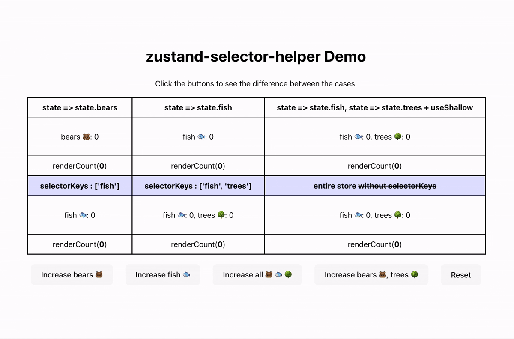

# Zustand Selector Helper

[](https://www.npmjs.com/package/@zuzokim/zustand-selector-helper)
[](https://www.npmjs.com/package/@zuzokim/zustand-selector-helper)
A utility library for creating type-safe and efficient selectors with [Zustand](https://github.com/pmndrs/zustand). Write concise code with string-based selector keys while maintaining full TypeScript support.

## ✨ Why?

With vanilla Zustand, if you want to select multiple pieces of state, you often end up writing verbose selector functions:

```tsx
const bears = useStore(state => state.bears);
const fish = useStore(state => state.fish);
const trees = useStore(state => state.trees);
// ...and so on
```

A common workaround is to return an object literal. But this creates a new object on every render, even if the values didn’t change.

```tsx
const { state1, state2, state3 } = useStore(state => ({
  state1: state.state1,
  state2: state.state2,
  state3: state.state3,
  // ...and so on
  // ⚠️ This object is freshly created on every render!
}));

// ❌ Zustand compares by reference
// → The selector always returns a "new object"
// → React thinks state changed
// → Component re-renders infinitely
```

### ✅ Official recommendation: [useShallow](https://zustand.docs.pmnd.rs/hooks/use-shallow#useshallow)

From the Zustand docs:

> "When you need to subscribe to a computed state from a store, the recommended way is to use a selector.
> The computed selector will cause a rerender if the output has changed according to Object.is.
> In this case you might want to use useShallow to avoid a rerender if the computed value is always shallow equal the previous one."

```tsx
import { useShallow } from 'zustand/shallow';

const { state1, state2 } = useStore(
  useShallow(state => ({
    state1: state.state1,
    state2: state.state2,
  })),
);
```

## 🚀 How this zustand-selector-helper improves it

While `useShallow` solves the re-render problem, the selector code is still:

- 🔁 Repetitive (state1: state.state1)
- 📜 Verbose (lots of boilerplate)
- 🧩 Easy to mistype keys, less TypeScript-friendly

With zustand-selector-helper, you can write:

```tsx
const { state1, state2, state3 } = useStore({
  selectorKeys: ['state1', 'state2', 'state3'],
});
```

### 🔍 How It Works

Under the hood, this:

- Automatically wraps selectors with Zustand's **built-in `useShallow`**.
- Concise, **string-based** selectors instead of manual functions, removing the need to manually map state.key => state.key. Infers the selected state type from the store → no need to define return types manually.
- Full **TypeScript safety** with autocompletion & key validation. Ensures only valid keys can be passed (selectorKeys are type-checked).

So you get:

✅ Shallow comparison (no unnecessary re-renders)
✅ Type-safe key selection
✅ Cleaner, more concise syntax

## ✨ Features

- **Type-safe by default** –
  Works seamlessly with **React** + **Zustand**.
  Autocompletion & key validation are fully supported out of the box.
- **Performance optimized** –
  Automatically uses Zustand’s `useShallow` for efficient updates.
  This avoids unnecessary re-renders by doing shallow comparison of objects.
  - ⚠️ Note: Zustand by default compares selector outputs with Object.is (reference equality). `useShallow` performs a shallow comparison (top-level properties only). If you need to track changes inside nested objects, you must handle it manually.
- **Concise syntax** –
  Write selectors with **string keys** (selectorKeys: ['key'])
  instead of verbose selector functions (state => state.key).
- **Flexible** –
  Works with any Zustand store structure, whether flat or nested.

## Installation

```bash
# npm
npm install @zuzokim/zustand-selector-helper

# yarn
yarn add @zuzokim/zustand-selector-helper

# pnpm
pnpm add @zuzokim/zustand-selector-helper
```

### Basic Usage

1. Create a typed selector

```tsx
// store.ts
import { createTypedSelector } from '@zuzokim/zustand-selector-helper';
import { useBearBaseStore } from './bearStore';

// Create a typed selector hook from your Zustand store
export const useBearStore = createTypedSelector(useBearBaseStore);
```

2. Use in a React component

```tsx
// Example.tsx
import { useBearStore } from './store';

function Example() {
  // Select only the keys you need
  const { bears, fish } = useBearStore({ selectorKeys: ['bears', 'fish'] });

  return (
    <div>
      <p>Bears: {bears}</p>
      <p>Fish: {fish}</p>
    </div>
  );
}
```

### Demo



### Example

- see [React Example](./examples/react-example/src/App.tsx)

```bash
pnpm run dev
```

## Contributing

Contributions are always welcome! Please feel free to submit a Pull Request.

1. Fork the repository
2. Create your feature branch (`git checkout -b feature/amazing-feature`)
3. Commit your changes (`git commit -m 'Add some amazing feature'`)
4. Push to the branch (`git push origin feature/amazing-feature`)
5. Open a Pull Request

## License

MIT License - see the [LICENSE](./packages/zustand-selector-helper/LICENSE) file for details.
